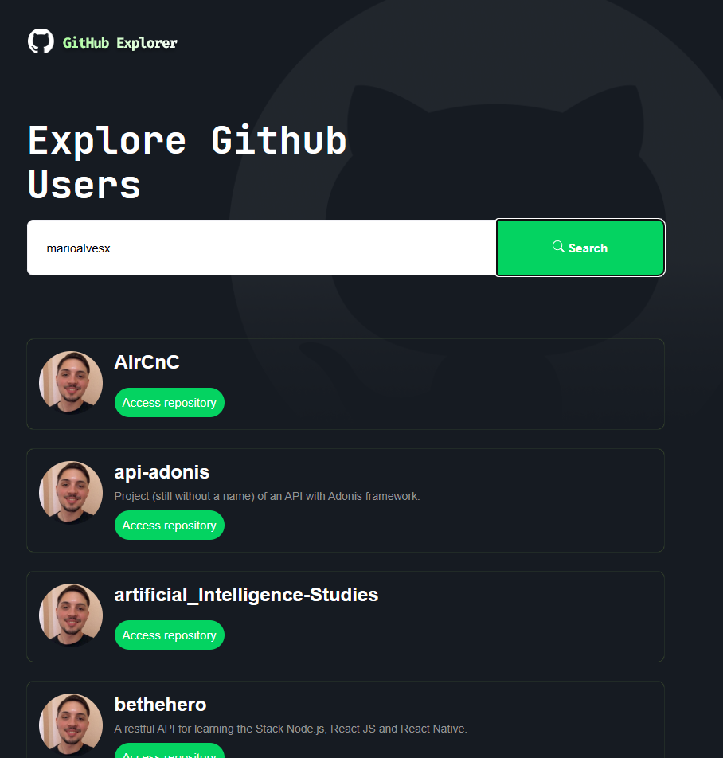

<p align="center">
   
</p>
<br />
<p align="center">
  
  
</p>

---

# :atom_symbol: Technologies

- React.
- TypeScript.
- Sass (superset of css).
- Babel.
- Webpack.

# :rocket: Features

- Explore repositories.
- Show repositories details as link, description and repository name.

# :construction_worker: Installation

**You need to install [Node.js](https://nodejs.org/en/download/) and [Yarn](https://yarnpkg.com/) first, then in order to clone the project via HTTPS, run this command:**

```
git clone https://github.com/marioalvesx/github-explorer.git
```

**Install dependencies**

```
yarn install
```

**Start development server**

```
yarn dev
```

# :tada: Acknowledgments

[Rocketseat](https://www.rocketseat.com.br/)

Made with 💜 by [Mario Alves](https://github.com/marioalvesx)
